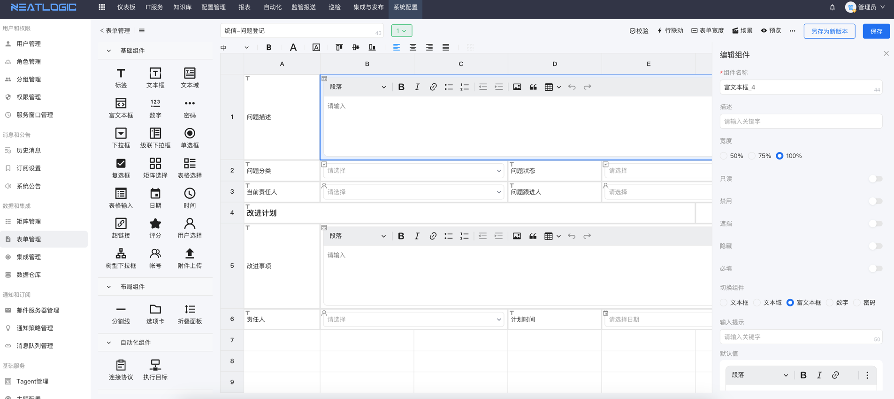
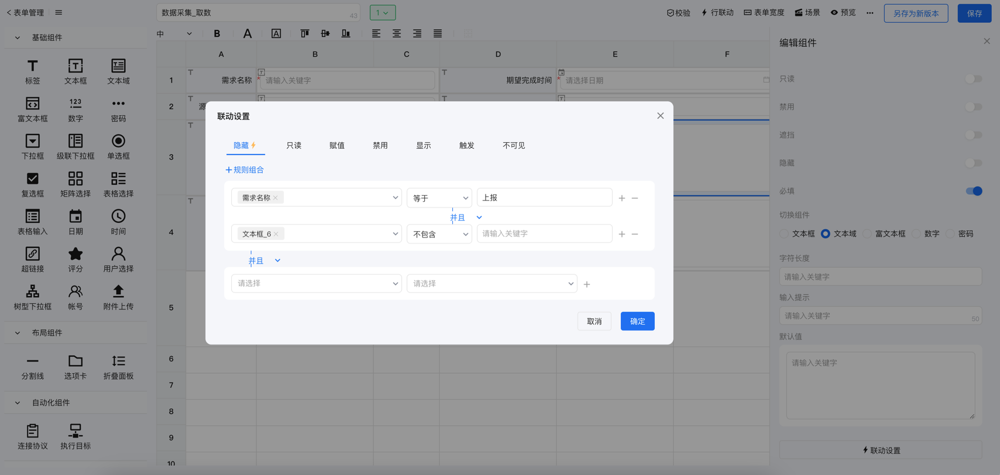

[中文](README.md) / English

## about

neatlogic-tenant is the business logic module of neatlogic-framework, which provides various basic services of
neatlogic, including user management, authority management, matrix management, integration management, form management,
data warehouse, interface audit, etc.

## Features

### Forms

Custom forms are currently mainly used by the itsm function of neatlogic-process, which can realize most complex form
application scenarios with zero code.

- Native support for various form components.
  

- Support the interaction and linkage between controls through configuration
  
- Support multiple scenarios, each scenario can reset the configuration of the form component, combined with the
  workflow engine, can realize different process steps associated with different form scenarios.
- Supports low-code configuration of custom components.
  

### Integration Management

Integrated management is used to centrally manage external interfaces, and all calls to third-party interfaces need to
be configured here.

- Support writing javascript to convert the structure of input and output parameters, so that the external interface and
  internal functions can be seamlessly connected.
  
- With audit function.
  

### Data warehouse

The data warehouse is used to extract data through query statements and store them in dynamically generated data tables
to meet frequent query scenarios, such as reports, large screens, dashboards, etc.

### Matrix

Matrices are used to convert data into two-dimensional tables and provide data source services for other functions, such
as custom forms. Support custom matrix (edit attributes by yourself), integration matrix (convert the interface in the
integration into a matrix), view matrix (reassemble data through SQL statements), etc.
