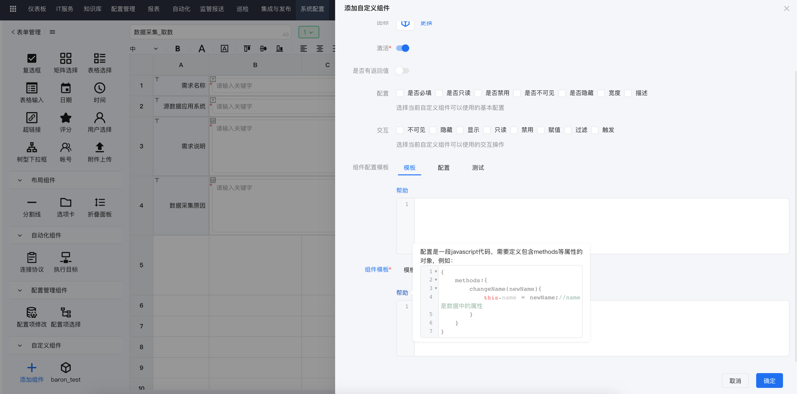
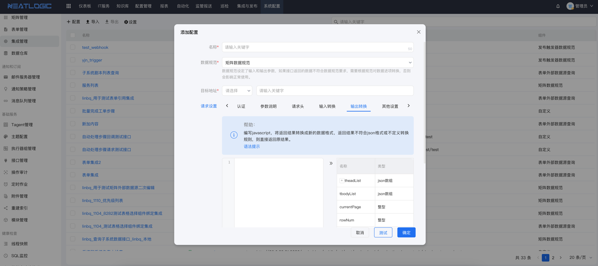
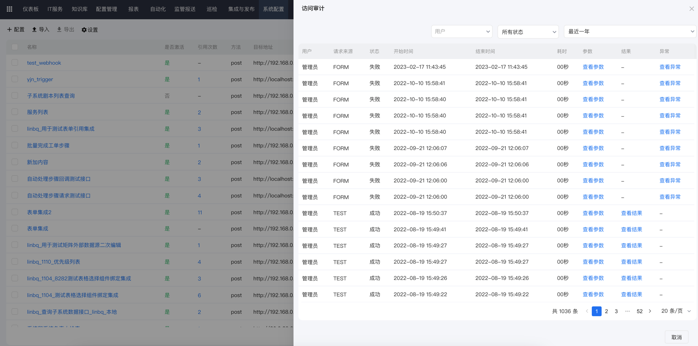
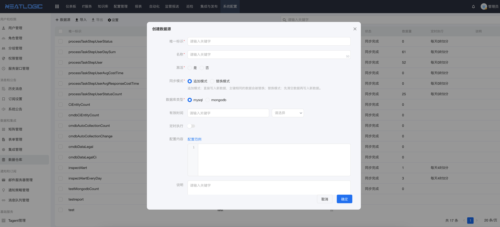
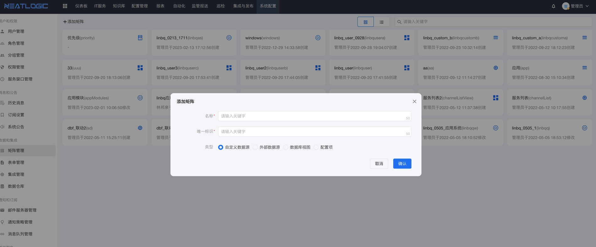

中文 / [English](README.en.md)

---

## 关于

neatlogic-tenant是neatlogic-framework的业务逻辑模块，提供neatlogic各种基础服务，包括用户管理、权限管理、矩阵管理、集成管理、表单管理、数据仓库、接口审计等。

## 主要功能

### 自定义表单

自定义表单目前主要是neatlogic-process的itsm功能使用，可以通过零代码的方式实现大部分复杂的表单应用场景。

- 原生支持多种表单组件。
  

- 支持通过配置方式实现控件之间交互联动
  
- 支持多场景，每个场景可以重新设置表单组件的配置，结合工作流引擎，可以实现不同流程步骤关联不同的表单场景。
- 支持低代码方式配置自定义组件。
  

### 集成管理

集成管理用于集中管理外部接口，所有对第三方接口的调用都需要在这里配置。

- 支持编写javascript对输入输出参数进行结构转换，让外部接口和内部功能可以无缝对接。
  
- 具备审计功能。
  

### 数据仓库

数据仓库用于把数据通过查询语句抽出来，存放到动态生成的数据表里，满足频繁的查询场景，例如报表、大屏、仪表板等。

### 矩阵

矩阵用于把数据转换成二维表形式，为其他功能提供数据源服务，例如自定义表单。支持自定义矩阵（自行编辑属性）、集成矩阵（把集成中的接口转换成矩阵）、视图矩阵（通过SQL语句重新组装数据）等。

## 功能列表

<table border="1"><t<table border="1"><tr><td>编号</td><td>分类</td><td>功能点</td><td>说明</td></tr><tr><td>1</td><td rowspan="11">基础</td><td rowspan="5">系统架构</td><td>平台采用前后端解耦架构，纯B/S架构无需安装任何插件，支持常用浏览器http/https访问。</td></tr><tr><td>2</td><td>支持前端界面和后端服务、以及执行节点高可用、分布式部署。</td></tr><tr><td>3</td><td>平台采用底层框架和诸多功能模块组成，由底层框架统一调度、驱动加载功能模块，形成完整的ITOM解决方案。</td></tr><tr><td>4</td><td>平台具备常用功能配置扩展能力，如IT服务的管理流程、表单、数据矩阵等功能点。</td></tr><tr><td>5</td><td>平台采用模块式架构，客户差异或定制需求形成交付的定制模块，用户可基于定制模块进行二次开发，包括：新增模块、新增流程组件、接口等功能。</td></tr><tr><td>6</td><td rowspan="2">用户、组织架构、角色管理</td><td>支持用户、组织架构、角色增删改查管理操作，以及用户与组关系、用户与角色关系、角色与组织架构权限关联定义。</td></tr><tr><td>7</td><td>不限制组织架构层级，支持不同层级、分组领导、岗位设置。</td></tr><tr><td>8</td><td>功能权限管理</td><td>支持功能权限赋权给角色、人员、组织架构，限制用户查看、操作等权限设置。</td></tr><tr><td>9</td><td>服务窗口</td><td>支持多维度服务窗口定义，支持工作日、上班时间段定义。</td></tr><tr><td>10</td><td>日志审计</td><td>平台上所有的管理操作记录到审计日志，可按操作对象、时间追溯。</td></tr><tr><td>11</td><td>快速贴图</td><td>支持系统的富文本框内快速贴图，方便用户操作。</td></tr><tr><td>12</td><td rowspan="6">仪表板</td><td rowspan="6">仪表板管理</td><td>支持用户定义系统层面、个人层面的仪表数据面板。</td></tr><tr><td>13</td><td>支持用户新增、修改、删除、复制、导入、导出仪表板。</td></tr><tr><td>14</td><td>仪表板支持文本、数据、表格、饼图、雷达图、柱形图、折线图、面积图、仪表盘、堆叠图、散点图、热力图等常用呈现组件</td></tr><tr><td>15</td><td>仪表板支持用户基于选择的呈现组件和对应的数据源，通过配置快速的呈现数据。</td></tr><tr><td>16</td><td>仪表板支持用户拖拽布局。</td></tr><tr><td>17</td><td>系统层面的仪表板支持授权到用户、角色、组织架构，具备授权的用户可查看对应的系统层面仪表板。</td></tr><tr><td>18</td><td rowspan="7">数据源</td><td rowspan="7">数据矩阵</td><td>支持用户自定义数据矩阵增删改查、导入、导出管理。</td></tr><tr><td>19</td><td>支持用户自定义静态数据源，自定义表头，配置数据，作为表单、报表等场景的下拉框、表格选择器等组件的数据源。</td></tr><tr><td>20</td><td>支持用户配置接口查询第三方数据，作为表单、报表等场景的下拉框、表格选择器等组件的数据源。</td></tr><tr><td>21</td><td>支持用户配置本系统CMDB视图数据，作为表单、报表等场景的下拉框、表格选择器等组件数据源。</td></tr><tr><td>22</td><td>支持用户配置SQL，创建查询视图，可查询系统内所有数据表数据，作为表单、报表等场景的下拉框、表格选择器等组件的数据源。</td></tr><tr><td>23</td><td>可复制现有矩阵，用于创建与原矩阵相似的新矩阵。</td></tr><tr><td>24</td><td>矩阵支持导出、导入，可用于在不同环境的环境迁移矩阵。</td></tr><tr><td>25</td><td rowspan="7">数据仓库</td><td rowspan="7">数据仓库</td><td>支持用户自定义数据数据仓库增删改查、导入、导出管理。</td></tr><tr><td>26</td><td>支持用户自定义数仓把基础过程数据表转换为统计类的高阶管理对象。</td></tr><tr><td>27</td><td>支持用户自定义数仓的数据源。</td></tr><tr><td>28</td><td>支持用户自定义数仓的数据对象，过滤条件</td></tr><tr><td>29</td><td>支持用户自定义数仓的数据模式，如全量替换或增量追加。</td></tr><tr><td>30</td><td>支持用户自定义人工同步数据、定时同步数据。</td></tr><tr><td>31</td><td>用户自定义数据源可用于大屏、仪表板、报表等消费场景。</td></tr><tr><td>32</td><td rowspan="8">集成</td><td rowspan="3">接口集成</td><td>支持用户自定义系统内部或系统外部rest接口的集成配置管理，包括接口的提交方式、认证方式、参数输出格式转换、参数输入格式转换。</td></tr><tr><td>33</td><td>支持用户自定义集成接口的入参和出参在线帮助字典，且支持直接在线接口调用测试。</td></tr><tr><td>34</td><td>支持集成接口清单的导入、导出、调用记录审计。</td></tr><tr><td>35</td><td rowspan="2">消息订阅</td><td>支持用户按消息类型订阅或取消订阅。</td></tr><tr><td>36</td><td>支持消息类型的临时订阅和持续订阅。</td></tr><tr><td>37</td><td rowspan="3">接口管理</td><td>平台采用前后端解耦架构，数据交互基于标准rest接口，接口分为内部接口和外部接口。在接口管理内可以查看接口的入参、出参、帮助、认证方式等说明。</td></tr><tr><td>38</td><td>接口支持开启调用记录，也关闭调用记录，防止高频调用接口记的录造成存储空间浪费</td></tr><tr><td>39</td><td>支持外部接口配置多个调用实例，以及认证方式、认证用户、认证密码、有效时间等配置。</td></tr><tr><td>40</td><td rowspan="11">报表</td><td rowspan="6">报表模板</td><td>支持用户新增、复制、导入、导出报表模板。</td></tr><tr><td>41</td><td>支持用户自定义报表模板的显示界面、过滤条件、以及数据源配置。</td></tr><tr><td>42</td><td>报表条件支持常用的HTML组件，如：文本框、下拉框、多选、单选、日期等控件，以及绑定控件数据源设置。</td></tr><tr><td>43</td><td>报表呈现支持常用的表格、曲线图、饼图、柱状图等常用控件。</td></tr><tr><td>44</td><td>报表数据源支持标准的TSQL语句和rest接口。</td></tr><tr><td>45</td><td>支持报表设置访问权限。</td></tr><tr><td>46</td><td rowspan="5">报表管理</td><td>支持报表基于模板快速生成不同维度的管理报表。</td></tr><tr><td>47</td><td>支持报表按权限划分，不同权限的用户可见不同的报表。</td></tr><tr><td>48</td><td>支持报表在线实时修改配置、更新配置，无需重启应用服务。</td></tr><tr><td>49</td><td>支持报表导出功能，导出的附件格式支持：Word、Execl、PDF。</td></tr><tr><td>50</td><td>支持配置报表定时发送策略。</td></tr></table>r><td>编号</td><td>分类</td><td>功能点</td><td>说明</td></tr><tr><td>1</td><td rowspan="11">基础</td><td rowspan="5">系统架构</td><td>平台采用前后端解耦架构，纯B/S架构无需安装任何插件，支持常用浏览器http/https访问。</td></tr><tr><td>2</td><td>支持前端界面和后端服务、以及执行节点高可用、分布式部署。</td></tr><tr><td>3</td><td>平台采用底层框架和诸多功能模块组成，由底层框架统一调度、驱动加载功能模块，形成完整的ITOM解决方案。</td></tr><tr><td>4</td><td>平台具备常用功能配置扩展能力，如IT服务的管理流程、表单、数据矩阵等功能点。</td></tr><tr><td>5</td><td>平台采用模块式架构，客户差异或定制需求形成交付的定制模块，用户可基于定制模块进行二次开发，包括：新增模块、新增流程组件、接口等功能。</td></tr><tr><td>6</td><td rowspan="2">用户、组织架构、角色管理</td><td>支持用户、组织架构、角色增删改查管理操作，以及用户与组关系、用户与角色关系、角色与组织架构权限关联定义。</td></tr><tr><td>7</td><td>不限制组织架构层级，支持不同层级、分组领导、岗位设置。</td></tr><tr><td>8</td><td>功能权限管理</td><td>支持功能权限赋权给角色、人员、组织架构，限制用户查看、操作等权限设置。</td></tr><tr><td>9</td><td>服务窗口</td><td>支持多维度服务窗口定义，支持工作日、上班时间段定义。</td></tr><tr><td>10</td><td>日志审计</td><td>平台上所有的管理操作记录到审计日志，可按操作对象、时间追溯。</td></tr><tr><td>11</td><td>快速贴图</td><td>支持系统的富文本框内快速贴图，方便用户操作。</td></tr><tr><td>12</td><td rowspan="6">仪表板</td><td rowspan="6">仪表板管理</td><td>支持用户定义系统层面、个人层面的仪表数据面板。</td></tr><tr><td>13</td><td>支持用户新增、修改、删除、复制、导入、导出仪表板。</td></tr><tr><td>14</td><td>仪表板支持文本、数据、表格、饼图、雷达图、柱形图、折线图、面积图、仪表盘、堆叠图、散点图、热力图等常用呈现组件</td></tr><tr><td>15</td><td>仪表板支持用户基于选择的呈现组件和对应的数据源，通过配置快速的呈现数据。</td></tr><tr><td>16</td><td>仪表板支持用户拖拽布局。</td></tr><tr><td>17</td><td>系统层面的仪表板支持授权到用户、角色、组织架构，具备授权的用户可查看对应的系统层面仪表板。</td></tr><tr><td>18</td><td rowspan="7">数据源</td><td rowspan="7">数据矩阵</td><td>支持用户自定义数据矩阵增删改查、导入、导出管理。</td></tr><tr><td>19</td><td>支持用户自定义静态数据源，自定义表头，配置数据，作为表单、报表等场景的下拉框、表格选择器等组件的数据源。</td></tr><tr><td>20</td><td>支持用户配置接口查询第三方数据，作为表单、报表等场景的下拉框、表格选择器等组件的数据源。</td></tr><tr><td>21</td><td>支持用户配置本系统CMDB视图数据，作为表单、报表等场景的下拉框、表格选择器等组件数据源。</td></tr><tr><td>22</td><td>支持用户配置SQL，创建查询视图，可查询系统内所有数据表数据，作为表单、报表等场景的下拉框、表格选择器等组件的数据源。</td></tr><tr><td>23</td><td>可复制现有矩阵，用于创建与原矩阵相似的新矩阵。</td></tr><tr><td>24</td><td>矩阵支持导出、导入，可用于在不同环境的环境迁移矩阵。</td></tr><tr><td>25</td><td rowspan="7">数据仓库</td><td rowspan="7">数据仓库</td><td>支持用户自定义数据数据仓库增删改查、导入、导出管理。</td></tr><tr><td>26</td><td>支持用户自定义数仓把基础过程数据表转换为统计类的高阶管理对象。</td></tr><tr><td>27</td><td>支持用户自定义数仓的数据源。</td></tr><tr><td>28</td><td>支持用户自定义数仓的数据对象，过滤条件</td></tr><tr><td>29</td><td>支持用户自定义数仓的数据模式，如全量替换或增量追加。</td></tr><tr><td>30</td><td>支持用户自定义人工同步数据、定时同步数据。</td></tr><tr><td>31</td><td>用户自定义数据源可用于大屏、仪表板、报表等消费场景。</td></tr><tr><td>32</td><td rowspan="8">集成</td><td rowspan="3">接口集成</td><td>支持用户自定义系统内部或系统外部rest接口的集成配置管理，包括接口的提交方式、认证方式、参数输出格式转换、参数输入格式转换。</td></tr><tr><td>33</td><td>支持用户自定义集成接口的入参和出参在线帮助字典，且支持直接在线接口调用测试。</td></tr><tr><td>34</td><td>支持集成接口清单的导入、导出、调用记录审计。</td></tr><tr><td>35</td><td rowspan="2">消息订阅</td><td>支持用户按消息类型订阅或取消订阅。</td></tr><tr><td>36</td><td>支持消息类型的临时订阅和持续订阅。</td></tr><tr><td>37</td><td rowspan="3">接口管理</td><td>平台采用前后端解耦架构，数据交互基于标准rest接口，接口分为内部接口和外部接口。在接口管理内可以查看接口的入参、出参、帮助、认证方式等说明。</td></tr><tr><td>38</td><td>接口支持开启调用记录，也关闭调用记录，防止高频调用接口记的录造成存储空间浪费</td></tr><tr><td>39</td><td>支持外部接口配置多个调用实例，以及认证方式、认证用户、认证密码、有效时间等配置。</td></tr><tr><td>40</td><td rowspan="11">报表</td><td rowspan="6">报表模板</td><td>支持用户新增、复制、导入、导出报表模板。</td></tr><tr><td>41</td><td>支持用户自定义报表模板的显示界面、过滤条件、以及数据源配置。</td></tr><tr><td>42</td><td>报表条件支持常用的HTML组件，如：文本框、下拉框、多选、单选、日期等控件，以及绑定控件数据源设置。</td></tr><tr><td>43</td><td>报表呈现支持常用的表格、曲线图、饼图、柱状图等常用控件。</td></tr><tr><td>44</td><td>报表数据源支持标准的TSQL语句和rest接口。</td></tr><tr><td>45</td><td>支持报表设置访问权限。</td></tr><tr><td>46</td><td rowspan="5">报表管理</td><td>支持报表基于模板快速生成不同维度的管理报表。</td></tr><tr><td>47</td><td>支持报表按权限划分，不同权限的用户可见不同的报表。</td></tr><tr><td>48</td><td>支持报表在线实时修改配置、更新配置，无需重启应用服务。</td></tr><tr><td>49</td><td>支持报表导出功能，导出的附件格式支持：Word、Execl、PDF。</td></tr><tr><td>50</td><td>支持配置报表定时发送策略。</td></tr></table>